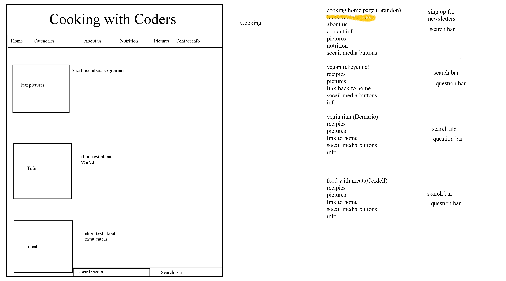

[Home](README.md)

# HTML 
- Hyper Text Markup Language
- **Semantic HTML** name implies function nav = navigation
  - body
    - **Content** -- goes inside of elements
    - header 
    - footer 
    - nav 
    - div
- tags - opening and closing `
` content `
`
- attributes -- examples: language,style(not advised),id,class,src,rel
- .
- Meta
- Personas -- user demographicsgit 
- Structure vs Presentation

HTML is the bones of the site

## HTML Reading NOTES

### Process and Design

### Who is the site for?

##### Target Audience

- age range
- country of access
- gender demo
- average level of education
- occupation
- hours of work week

### Why are people visiting?

- to achieve a specific goal
- entertainment
- general information
- information on a specific product or service

### What information do visitors need?

- are visitors familiar with information or will they need to be introduced to it?
- important features of site
- what differentiates your site

<is the site you are building one that will need to be updated often by nature ?>

### Site Maps

- important to think about what your visitors might aswsume about the sites layout

### Wireframes

- a simple sketch of the key elements of your site

